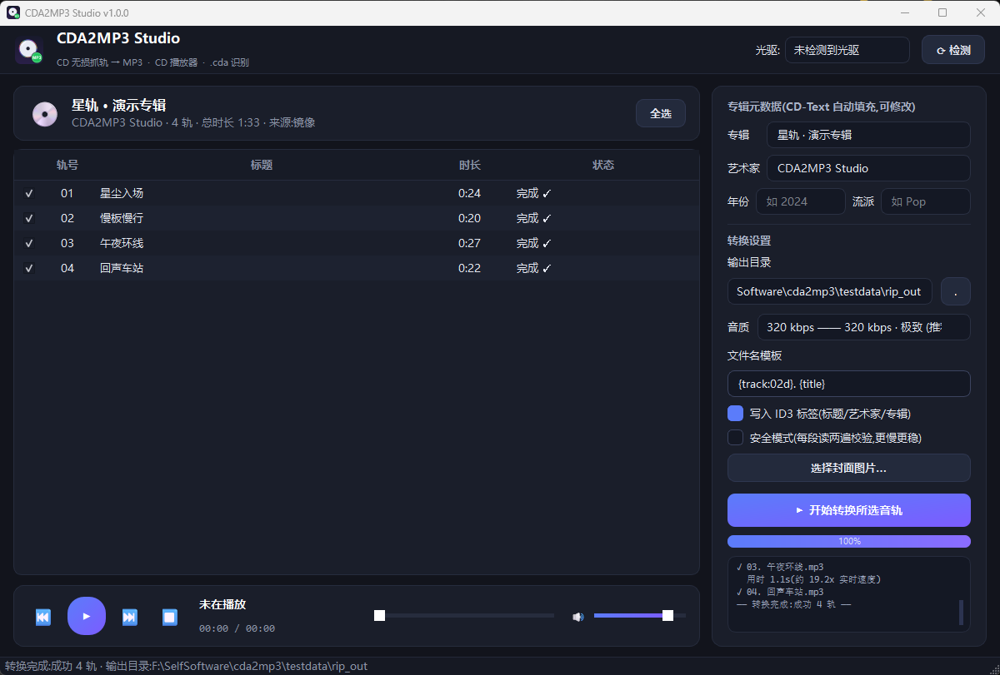
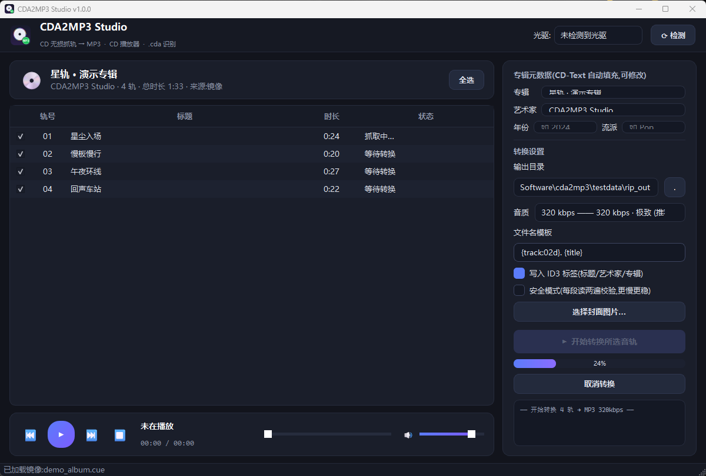
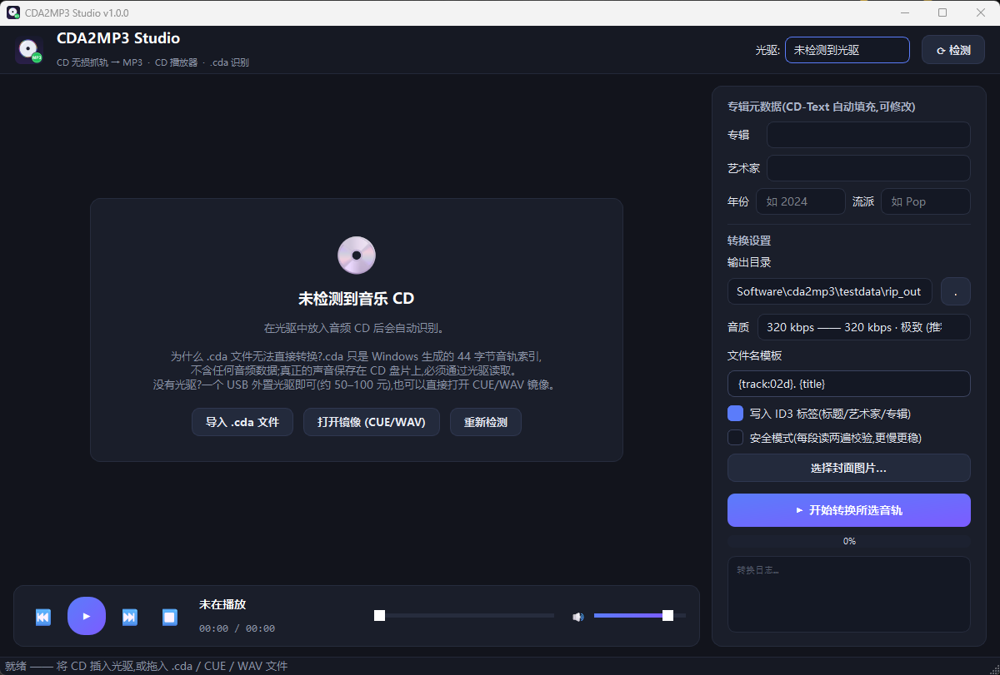

<div align="center">


# CDA2MP3 Studio

**CD 无损抓轨 → MP3 · CD 播放器 · .cda 识别 —— 三合一的 Windows 工具**

[](../../releases)
[](requirements.txt)
[](LICENSE)
[](../../releases/latest)

*无需安装 · 单文件 EXE · 零第三方 DLL · 离线可用*

[下载 EXE](#-快速开始) · [功能](#-功能特性) · [为什么 .cda 转不了?](#-为什么-cda-文件无法直接转换) · [命令行](#-命令行用法) · [构建](#-自行构建) · [在线主页](https://jensen-yao.github.io/cda2mp3/)

</div>

---

## 📸 界面预览

| 主界面(抓轨完成) | 转换进行中 | 空状态引导 |
| :---: | :---: | :---: |
|  |  |  |

## ✨ 功能特性

- 🎵 **CD 实时播放器** —— 插入 CD 即自动识别,支持 播放/暂停/上下曲/拖动进度/音量,读取无需经码率损失
- ⚡ **无损抓轨转 MP3** —— SPTI 直读光驱原始 2352 字节音频扇区,经 LAME 编码,**320 kbps 极致音质**(亦可选 256/192/128)
- 💿 **.cda 智能识别** —— 把网上到处“转不动”的 `.cda` 快捷方式拖进来,自动解析轨号/时长,提示需要原盘;放入对应 CD 后自动衔接标题、一键转换
- 🏷️ **元数据完整** —— 自动读取 **CD-Text**(专辑/艺术家/曲目名,支持中文),可编辑,写入 **ID3v2.3** 标签,支持嵌入封面图
- 🛡️ **安全模式** —— 每段音频读两遍逐字节校验,老划痕盘也能安心抓
- 📀 **镜像支持** —— 没有 CD?直接打开 **CUE + WAV/BIN** 整轨镜像抓轨、播放
- 🖥️ **现代深色 UI** —— PySide6 打造,随插随用,转换进度/日志一目了然
- 🔌 **USB 光驱深度兼容** —— 自动探测桥接芯片能力,SCSI 直通不可用时无缝切换系统原生 RAW_READ 通道,自适应传输块大小;实测兼容对 0xBE 命令"吞命令"的廉价 USB 桥
- 📦 **真·单文件** —— PyInstaller 打包,免安装、免驱动依赖、完全离线

## 🚀 快速开始

1. 到 [**Releases**](../../releases/latest) 下载 `CDA2MP3Studio.exe`(单文件)
2. 双击运行(首次运行 SmartScreen 提示 → 点 **更多信息 → 仍要运行**)
3. 把音频 CD 放进光驱,软件 2 秒内自动识别
4. 勾选音轨 → 选输出目录 → 点 **开始转换**

> 没有光驱?USB 外置 DVD/CD 光驱即可(约 50–100 元),即插即用无需驱动。

## 🤔 为什么 .cda 文件无法直接转换?

这是全网无数人踩过的坑,划重点:

> **`.cda` 不是音频文件!** 它是 Windows 为音频 CD 每一轨自动生成的“快捷方式”,固定 **44 字节**,
> 里面只有轨号、起始扇区、时长这些索引信息,连 1 字节的声音数据都没有(RIFF/CDDA 头可验证)。
> 所以任何声称“直接把 .cda 转成 MP3”的软件都是做不到的——声音只存在于 CD 盘片上。

本软件的做法:**解析 .cda 拿到音轨清单 → 等你放入原版 CD → 自动比对 TOC 衔接 → SPTI 从光驱抓取原始 PCM → LAME 编码 MP3**。
把桌面上的 `.cda` 文件直接拖进窗口就能看到这张专辑的完整信息。

## ⌨️ 命令行用法

```bat
:: 列出光驱
CDA2MP3Studio.exe --list-drives

:: 整盘抓取(全部音频轨 → 320kbps MP3 + ID3 标签)
CDA2MP3Studio.exe --rip --out "D:\Music\我的CD" --bitrate 320

:: 只抓 1、3-5 轨,开安全校验
CDA2MP3Studio.exe --rip --tracks 1,3-5 --verify --album "专辑名"

:: 处理 CUE/WAV 镜像(无需光驱)
CDA2MP3Studio.exe --image album.cue --rip --out D:\out

:: 8 倍速限速温和读盘 + 双读校验(划痕盘/珍贵碟推荐)
CDA2MP3Studio.exe --rip --speed 8 --verify --out "D:\Music"

:: 图形界面直接打开镜像
CDA2MP3Studio.exe --image album.cue
```

## 🏗️ 技术架构

```text
┌─────────────────────────────────────────────────────┐
│                PySide6 深色 GUI / CLI               │
├──────────────────┬──────────────────┬───────────────┤
│   CD 播放引擎     │    抓轨 Worker   │  .cda 解析器  │
│ sounddevice 输出  │  QThread + 进度  │ RIFF/CDDA 44B │
├──────────────────┴──────────────────┴───────────────┤
│              统一光盘抽象 DiscSource                 │
│      SptiDrive(物理光驱)   ImageDisc(CUE/WAV/BIN) │
├─────────────────────────────────────────────────────┤
│  Windows SPTI:DeviceIoControl + SCSI CDB            │
│  READ TOC(0x43) · CD-Text(fmt 5) · READ CD(0xBE) │
├─────────────────────────────────────────────────────┤
│        LAME(lameenc)MP3 编码 · mutagen ID3          │
└─────────────────────────────────────────────────────┘
```

- **零第三方 DLL**:不依赖 ASPI/libcdio/ffmpeg,SPTI 通过 `ctypes` 直接调用 `DeviceIoControl`
- **读轨**:SCSI `READ CD (0xBE)` 直取 2352B 原始扇区,失败自动重试,安全模式双读校验
- **播放**:后台线程预读扇区 → PortAudio 回调输出,支持轨内 seek
- **编码**:LAME 320kbps CBR,实测约 20–50× 实时速度

## 🛠️ 自行构建

```bash
git clone https://github.com/Jensen-Yao/cda2mp3.git
cd cda2mp3
python -m venv .venv
.venv\Scripts\pip install -r requirements.txt pyinstaller

:: 运行测试(虚拟光盘端到端:TOC → 抓轨 → MP3 → 标签校验)
.venv\Scripts\python tests\test_pipeline.py

:: 打包单文件 EXE
.venv\Scripts\pyinstaller --noconfirm --onefile --windowed ^
  --icon assets/icon.ico --name CDA2MP3Studio ^
  --add-data "assets/icon.ico;assets" --add-data "assets/icon.png;assets" app.py
```

## 📁 项目结构

```text
cda2mp3/
├── app.py                    # PyInstaller 入口
├── cda2mp3/
│   ├── app.py                # 参数解析 / CLI 抓轨
│   ├── cdrom/
│   │   ├── spti.py           # SPTI 直读光驱(TOC/CD-Text/READ CD)
│   │   ├── virtual.py        # CUE/WAV/BIN 虚拟光盘
│   │   ├── cdafile.py        # .cda 44 字节索引解析
│   │   └── base.py           # DiscSource 统一抽象
│   ├── audio/
│   │   ├── encoder.py        # LAME 编码 + ID3 标签
│   │   └── player.py         # 实时播放引擎
│   ├── ui/                   # PySide6 界面/主题/后台线程
│   ├── demo_synth.py         # 演示虚拟专辑合成(测试用)
│   └── config.py             # 配置持久化
├── tests/test_pipeline.py    # 端到端流水线测试
├── assets/                   # 图标与生成脚本
├── docs/index.html           # GitHub Pages 主页
└── screenshots/              # README 宣传图
```

## ❓常见问题

<details>
<summary><b>提示“光驱中没有光盘”?</b></summary>

确认放入的是**音乐 CD** 而非数据盘;台式机光驱一般支持,笔记本没有光驱的话买个 USB 外置光驱。
</details>

<details>
<summary><b>抓出来的轨道有杂音/爆音?</b></summary>

盘面可能有划痕,在设置里勾选 **安全模式(双读校验)** 后重试;严重划伤的段落会明确报错而不是静默出错。
</details>

<details>
<summary><b>只有整轨 WAV/BIN 镜像,没有 CD?</b></summary>

直接 `打开镜像 (CUE/WAV)` 或把 `.cue` 拖进窗口,虚拟光盘和真 CD 功能完全一致。
</details>

<details>
<summary><b>SmartScreen 拦截?</b></summary>

单文件 EXE 未做代码签名(签名证书每年几百刀 😅)。点 **更多信息 → 仍要运行** 即可;不放心可以按上文自行构建。
</details>

## 🗺️ Roadmap

- [ ] freedb/MusicBrainz 在线元数据补全
- [ ] FLAC / WAV 无损输出
- [ ] 抓轨偏移(驱动器偏移校正)
- [ ] 多语言界面

## 📄 许可证

[MIT](LICENSE) © 2026 Jensen-Yao

---

<div align="center">

**如果这个项目帮到了你,欢迎点个 ⭐ Star!**

[](https://star-history.com/#Jensen-Yao/cda2mp3&Date)

</div>
